<h3><code>vishal@github ~ $ ./contributions.sh</code></h3>

  

<h3><code>vishal@github ~ $ whoami</code></h3>

<table>
<tr>
<td valign="top" width="370">

</td>
<td valign="top" width="490">

</td>
</tr>
</table>

  

<a href="https://dev-vishal.netlify.app/">Portfolio</a> ·
<a href="https://www.linkedin.com/in/vishal-khandate/">LinkedIn</a> ·
<a href="https://leetcode.com/u/vishal_khandate2001/">LeetCode</a>

