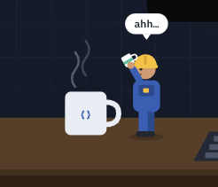

<h3><code>vishal@github ~ $ ./contributions.sh</code></h3>

  

<h3><code>vishal@github ~ $ whoami</code></h3>

<table>
<tr>
<td valign="top" width="370">

</td>
<td valign="top" width="490">

</td>
</tr>
</table>

  

<table>
<tr>
<td width="33%" valign="middle">
<table><tr>
<td width="110"></td>
<td align="left"><a href="https://dev-vishal.netlify.app/"><b>Portfolio</b></a> Projects, writeups, and shipped work</td>
</tr></table>
</td>
<td width="33%" valign="middle">
<table><tr>
<td width="44"></td>
<td align="left"><a href="https://www.linkedin.com/in/vishal-khandate/"><b>LinkedIn</b></a> Open to connecting and collaborating</td>
</tr></table>
</td>
<td width="33%" valign="middle">
<table><tr>
<td width="44"></td>
<td align="left"><a href="https://leetcode.com/u/vishal_khandate2001/"><b>LeetCode</b></a> DSA practice and contest history</td>
</tr></table>
</td>
</tr>
</table>

